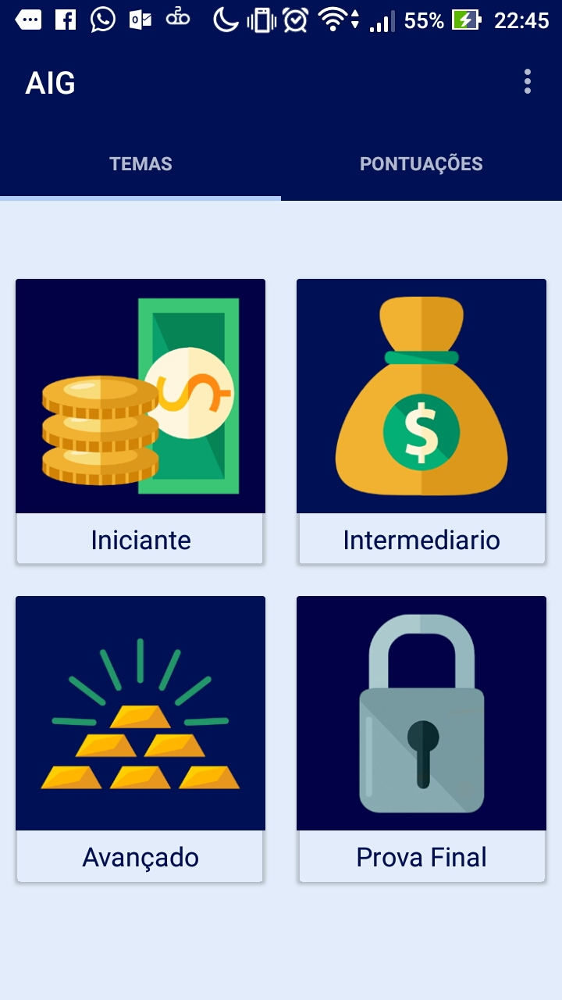
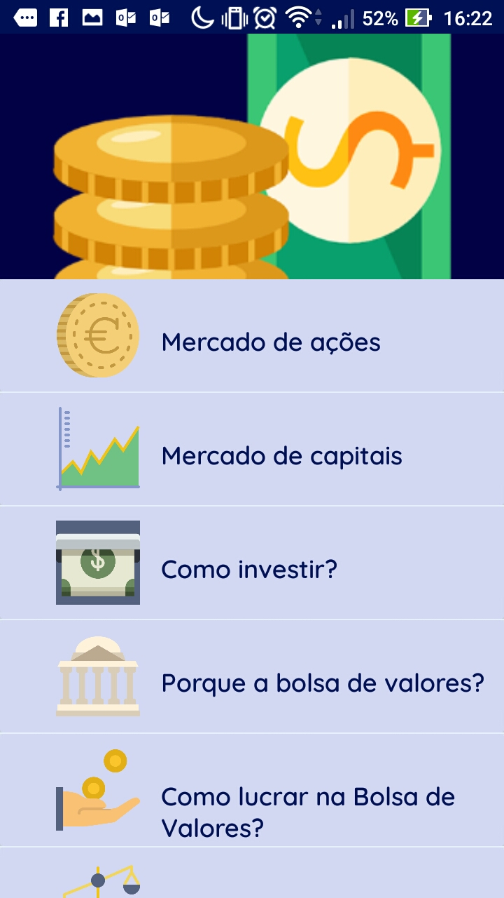

# AIG
Aprender Investir Ganhar (Learn Invest Win).

AIG is an educational application that seeks to educate people with basic knowledge about economics and equity investing.

Here we have aig login screen.

</img>

after logged in

After login, the app will display the screen with the lesson categories (Beginner, Intermediate and Advanced).

</img>

After choosing one of the categories, a list with all the lessons of the categories will be presented (it is recommended to follow them in order), at the end of the list there will be a quiz for the user to practice what he has read.

</img>
